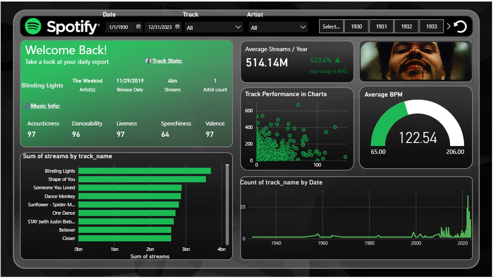

# 🎵 Spotify Music Analytics Dashboard (Power BI)

This repository showcases a Power BI dashboard that analyzes and visualizes Spotify music streaming data with a focus on track-level insights.

## 📊 Dashboard Overview

The dashboard provides an interactive report on the most streamed songs on Spotify, with detailed audio features and performance indicators. The design is inspired by the Spotify aesthetic for intuitive user experience.

## 🧾 Key Features

- **Track Metadata**
  - Example: *Blinding Lights* by The Weeknd
  - Release Date, Streams, Artist Count

- **Music Info Stats**
  - Acousticness, Danceability, Liveness, Speechiness, Valence

- **Visual Insights**
  - 🎯 Average Streams / Year
  - 📈 Track Performance in Charts
  - 📊 Streams by Track Name
  - 🎵 Average BPM
  - 🗓️ Count of Tracks by Date

## 📁 Files

- `Spotify_Analytics_Dashboard.pbix` 
- `d70bae17-6881-46b3-a10b-b67489e7432c.png` – Dashboard Preview

## 🛠 How to Use

1. Open the `.pbix` file in Power BI Desktop (if included).
2. Explore the interactive visuals and filter by year, artist, or track.
3. Analyze trends and compare track performance over time.

## 📌 Notes

- This dashboard uses **mock or public dataset samples** for demonstration.
- Power BI Desktop is required to interact with the `.pbix` file (not included in this version).

---

